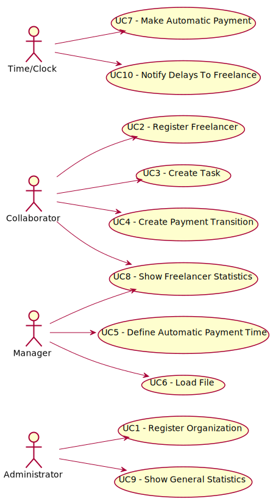

# Diagrama de Casos de Uso

**Para cada caso de uso deve ser realizada a sua descrição (perspetiva de engenharia de requisitos) e a sua realização (perspetiva de design).**

# Casos de Uso
| UC  | Descrição                                                               |
|:----|:------------------------------------------------------------------------|
| UC1 | [Register Organization](UC1_RegisterOrganization/UC1_RegisterOrganization.md)   |
| UC2 | [Register Freelancer](UC2_RegisterFreelancer/UC2_RegisterFreelancer.md)  |
| UC3 | [Create Task](UC3_CreateTask/UC3_CreateTask.md)|
| UC4 | [Create Payment Transition](UC4_CreatePaymentTransition/UC4_CreatePaymentTransition.md)|
| UC5 | [Define Automatic Payment Time](UC5_DefineAutomaticPaymentTime/UC5_DefineAutomaticPaymentTime.md) |
| UC6 | [Load File](UC6_LoadFile/UC6_LoadFile.md)|
| UC7 | [Make Automatic Payment](UC7_MakeAutomaticPayment/UC7_MakeAutomaticPayment.md)|
| UC8 | [Show Freelancer Statistics](UC8_ShowFreelancerStatistics/UC8_ShowFreelancerStatistics.md)|
| UC9 | [Show General Statistics](UC9_ShowGeneralStatistics/UC9_ShowGeneralStatistics.md)|
| UC10 | [Notify Delays To Freelancer](UC10_NotifyDelaysToFreelancer/UC10_NotifyDelaysToFreelancer.md)|
