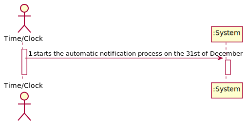
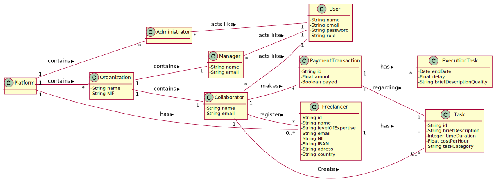
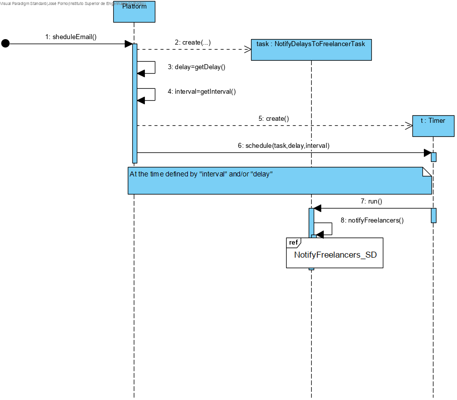
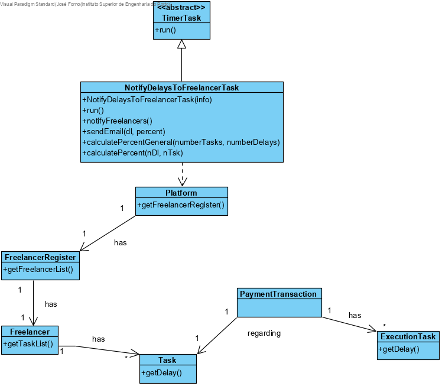

# UC10 - Notify Delays To Freelancer

## 1. Requirements Engineering

### Brief Format

The Time/Clock starts the automatic notification process on the 31st of December.

### SSD

### Full Format

#### Main actor

Time/Clock

#### Stakeholders and their interests
* **T4J:** wants the freelancers to be notified about their task delay time.

#### Preconditions
* At least one freelancer needs to be registered
* At least one task per freelancer

#### Postconditions
* An email is sent to the correct freelancers about their task delay time.

#### Main success scenario (or basic flow)

1. The Time/Clock starts the automatic notification process on the 31st of December
2. The system gathers all the freelancers that have at least one task delay time higher than 3 hours and a percentage of delays that is higher than the overall percentage of delays.
3. The system sends an email to all the freelancers in the list gathered in step 2.

#### Extensions (or alternative flows)

2a. The system detects that there aren't any freelancers who meet the parameters.
>	"The use case ends"

#### Special requirements
\-

#### List of Technologies and Data Variations
\-

#### Frequency of Occurrence
\- Once every year

#### Open questions

*

## 2. OO Analysis

### Excerpt from the Relevant Domain Model for the UC

## 3. Design - Use Case Realization

### Racional

| Main Flow | Question: What Class... | Answer  | Justification  |
|:--------------  |:---------------------- |:----------|:---------------------------- |
|1. The Time/Clock starts the automatic notification process on the 31st of December.|...coordenates the UC?  |NotifyDelaysToFreelancerTask  |Pure Fabrication|
|2. The system gathers all the freelancers that have at least one task delay time higher than 3 hours and a percentage of delays that is higher than the overall percentage of delays.|...knows the Freelancers?|Platform|Information Expert: in the MD the Platform has Freelancer|
|||FreelancerRegister|IE: in the MD the Platform has Freelancer and by HC+LC aplication it delegates this function to FreelancerRegister|
||...knows the Tasks?|Organization|IE: in the MD the Organization has the Task|
|||TaskList|IE: in the MD the Organization has the Task and by HC+LC aplication it delegates this responsability to TaskList|
||...knows the PaymentTransaction|Task|IE: in the MD Task and PaymentTransaction are conected|
||...knows the ExecutionTask|PaymentTransaction|IE: in the MD PaymentTransaction has ExecutionTask |
||...knows the delay time of each task|ExecutionTask|IE: knows it's own data|
|3. The system sends an email to all the freelancers in the list gathered in step 2.|...knows the email of the Freelancer?|Freelancer|IE:knows it's own data|

### Systematization ##

 It follows from the rational that the conceptual classes promoted to software classes are:

 * Plataform
 * Organization
 * Task
 * Freelancer

Other software classes (i.e. Pure Fabrication) identified:

 * NotifyDelaysToFreelancerTask
 * FreelancerRegister
 * TaskList

###	Sequence Diagram

##### NotifyFreelancers_SD

##### PercentGeneralSD

###	Class Diagram

