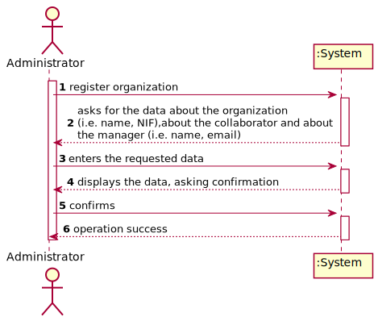
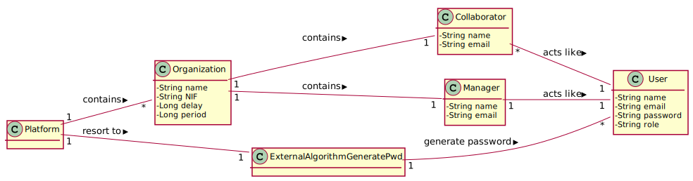
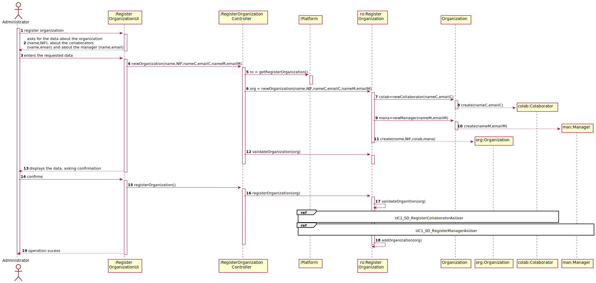
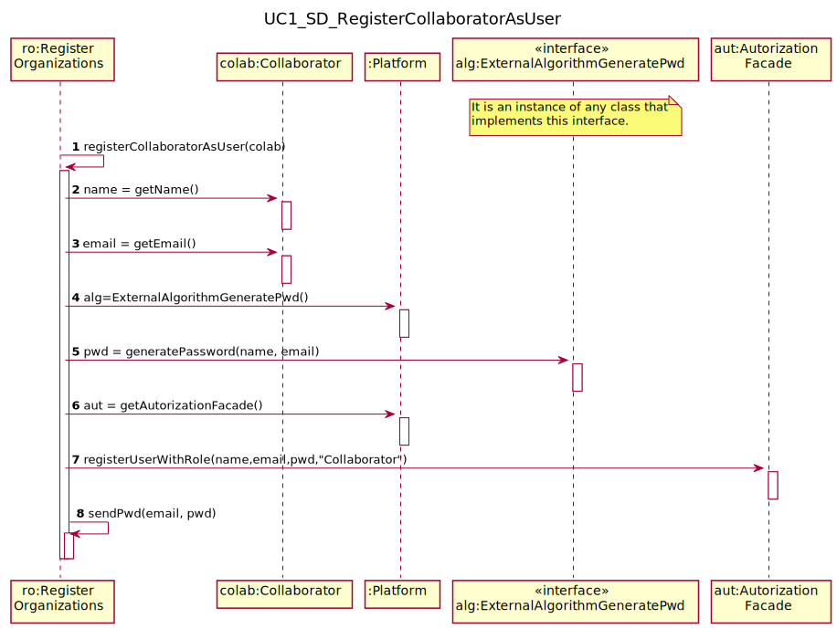
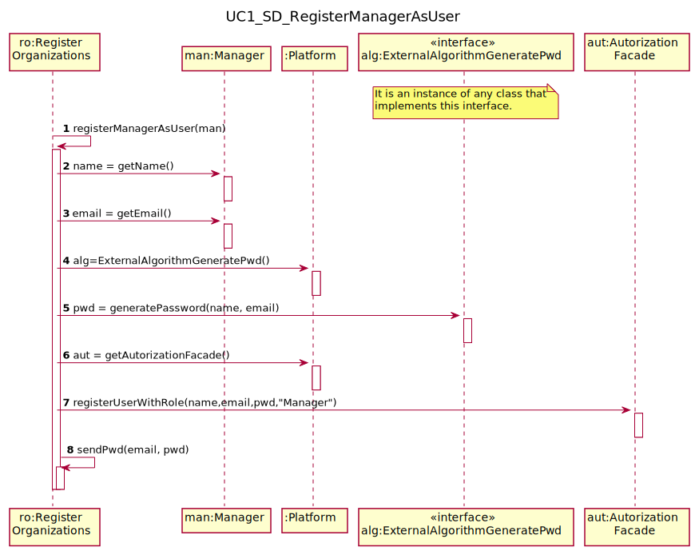
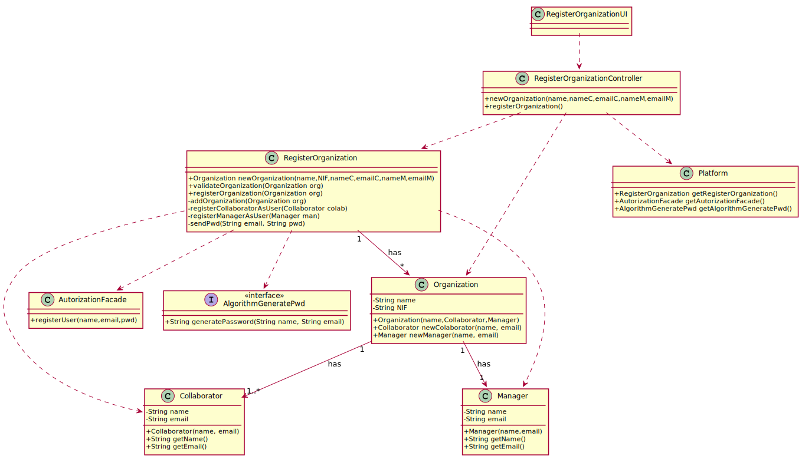
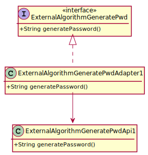

# UC1 - Register Organization

## 1. Requirements Engineering

### Brief Format

The administrator starts registering an organization. The system asks for the necessary data about the organization (i.e. name of the organization,NIF),about the collaborator and about the manager who is being registered (i.e. name, email). The administrator enters the requested data. The system validates and displays the data, asking confirmation. The administrator confirms. The system the system records the data of the organization and its collaborator / manager, making the latter a registered user and informs the administrator of the success of the operation.

### SSD

### Full Format

#### Main actor

Administrator

#### Stakeholders and their interests
* **Administrator:** intends to register the organization to which it belongs so that it can take advantage of the features provided by the platform.
* **T4J:** wants the organization to be registered in order to use the platform.

#### Preconditions
n/a

#### Postconditions
* The registration information about the organization is saved in the system.
* The registration information about the manager is saved in the system.
* The registration information about the collaborator is saved in the system.
* An email is sent to the manager and to the collaborator with the access information to the platform.

#### Main success scenario (or basic flow)

1. The Administrator starts registering an organization.
2. The system asks for the necessary data about the organization (i.e. name of the organization,NIF) ,about the collaborator and about the manager who is being registered (i.e. name, email).
3. The Administrator enters the requested data.
4. The system validates and displays the data, asking confirmation.
5. The Administrator confirms.
6. The system the system records the data of the organization and its collaborator / manager, making the latter a registered user and informs the Administrator of the success of the operation.

#### Extensions (or alternative flows)

*a. The Administrator requests to cancel the registration.

> The use case ends.

4b. Missing minimum required data.
>	1. The system informs you which data is missing.
>	2. The system allows you to enter the missing data (step 3)
>
	>	2a. The Administrator does not change the data. The use case ends.

4c. The system detects that the data (or some subset of the data) entered must be unique and that it already exists in the system.
>	1. The system alerts the Administrator to the fact.
>	2. The system allows you to change it (step 3)
>
	>	2a. The Administrator does not change the data. The use case ends.

#### Special requirements
\-

#### List of Technologies and Data Variations
\-

#### Frequency of Occurrence
\-

#### Open questions

* Are there any other mandatory data in addition to those already known?
* What data together can detect the duplication of organizations (and managers)?
* Is there an additional security mechanism necessary to confirm that the organization exists and is represented by the person who registered it?
* What are the security rules applicable to the password?
* How often does this use case occur?

## 2. OO Analysis

### Excerpt from the Relevant Domain Model for the UC

## 3. Design - Use Case Realization

### Racional

| Main Flow | Question: What Class... | Answer  | Justification  |
|:--------------  |:---------------------- |:----------|:---------------------------- |
|1. The Administrator starts registering an organization.|... interacts with the user?| RegisterOrganizationUI |Pure Fabrication|
| |... coordinates the UC?| RegisterOrganizationController |Controller|
| |... creates instances of Organization?|RegisterOrganization|HC+LC: the platform delegates this responsibility to RegisterOrganization|
|2. The system asks for the necessary data about the organization (i.e. name of the organization,NIF) ,about the collaborator and about the manager who is being registered (i.e. name, emai).||||
|3. The Administrator enters the requested data. |... saves the entered data?|Organization,Collaborator,Manager|IE: instance created in step 1|
| |...creates instances of Collaborator?|Organization|creator(rule1)|
| |...creates instances of Manager?|Organization|creator(rule1)|
|4. The system validates and displays the data, asking confirmation. |... validates the Organization's data (local validation)|Organization|IE: has its own data|
| |... validates the Organization's data (local validation)|Manager|IE: has its own data|
| |... validates the Organization's data (local validation)|Collaborator|IE: has its own data|
| |... validates the Organization's data (global validation)|RegisterOrganization|IE:RegisterOrganization has Organization registered|
|5. The Administrator confirms. ||||
|6. The system the system records the data of the organization and its collaborator / manager, making the latter a registered user and informs the Administrator of the success of the operation.|... saves the created Organization| RegisterOrganization |IE: By HC+LC aplication to the platform|
| |...generates a password|ExternalAlgorithmGeneratePwd|Protected Variations|
| |...regists/saves the User regarding the Organization's Colaborator and Manager?|AutorizationFacade|IE. User management is the responsibility of the respective external component whose point of interaction is through the class "AutorizationFacade"|
| |...sends an email to the colaborator and to the manager|RegisterOrganization|IE: has the necessary information|

### Systematization ##

 It follows from the rational that the conceptual classes promoted to software classes are:

 * Plataform
 * Organization
 * Collaborator
 * Manager
 * ExternalAlgorithmGeneratePwd

Other software classes (i.e. Pure Fabrication) identified:

 * RegisterOrganizacaoUI  
 * RegisterOrganizacaoController
 * AutorizationFacade
 * RegisterOrganization

###	Sequence Diagram

##### UC1_SD_RegisterCollaboratorAsUser

##### UC1_SD_RegisterManagerAsUser

###	Class Diagram

##### Generate password CD

