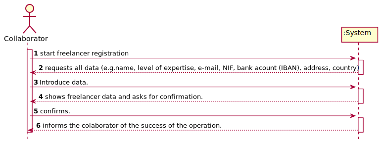
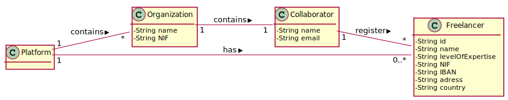
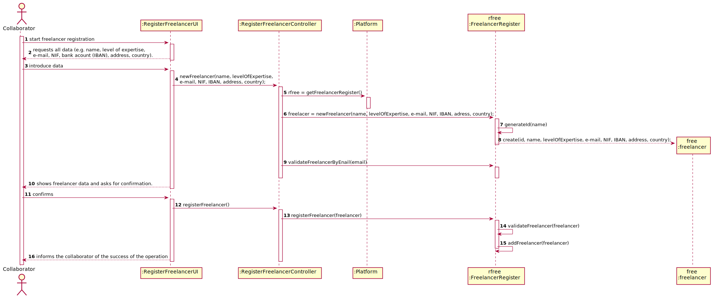
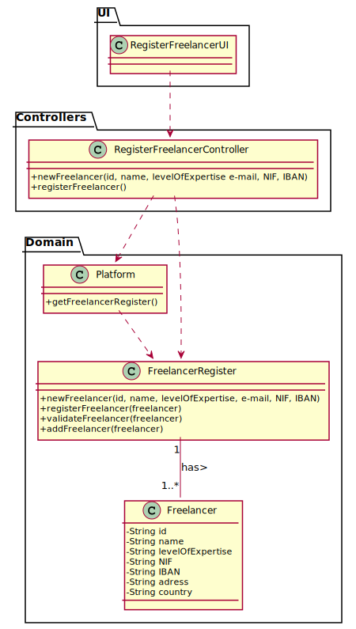

# UC 2 - Register Freelancer

## 1. Requirements Engineering

### Brief Format

The collaborator start freelancer registration. The System requests all data (e.g. name, level of expertise, e-mail, NIF, bank acount (IBAN), address, country). The collaborator introduce data. The System shows freelancer data and asks for confirmation. The collaborator confirms. The System informs the collaborator of the success of the operation.

### SSD

### Complete Format

#### Main Actor

* Collaborator

#### Stakeholders and their interests

* **Collaborator:** want to register the freelancer.
* **Freelancer:** wants to be registered.
* **T4J:** want freelancers to be registered.

#### Pre-conditions

* n\a

#### Pos-conditions
* The Freelancer registration information is saved in the system.

#### Main success scenario (or basic flow)

1. The collaborator start freelancer registration.
2. The System requests all data (e.g. name, level of expertise, e-mail, NIF, bank acount (IBAN), address, country).
3. The Collaborator introduce data.
4. The System validate and shows freelancer data and asks for confirmation.
5. The collaborator confirms.
6. The System register the freelancer in the system and informs the collaborator of the success of the operation.

#### Extensions (or alternative flows)

*a The Collaborator requests the cancellation of the registration.
>The use case ends.

4a. Missing mandatory data.
>1. The system informs about the missing data.
>2. The system alows for the introduction of missing data (step 3).
>> 2a. The Collaborator doesn't change the data. The use case ends.

4b. The system detects that the data (or some subset of the data) entered * (e.g. email) * must be unique and that it already exists in the system.

>1. The system alerts the administrative to the fact.
>2. The system allows you to change it (step 3)
>> 2a. The Collaborator doesn't change the data. The use case ends.

#### Special Requirements

\-

#### List of changes in technology data

\-

#### Frequency of Occurrence

\-

#### Open Questions

* Are there any other mandatory data in addition to those already known?
* What data together can detect the duplication of freelancers?
* How often does this use case occur?
* Is all data required?

## 2. OO Analysis

## 3. Design - Use Case Realization

### Rational

| Main Flow | Question: What Class ... | Answer  | Justification  |
|:--------- |:------------------------ |:--------|:-------------- |
| 1. The collaborator start freelancer registration | ...interacts with the user ? | RegisterFreelancerUI | Pure Fabrication |
| | ... coordinates the UC? | RegisterFreelancerController | Controller |
| | ...creates Freelancer instance? | Platform | Creator (Rule 1): on MD the platform has freelancers |
| | | FreelancerRegister | IE: in MD the platform has freelancers. By application of HC + LC delegates this function to FreelancerRegister |
| 2. The System requests all data (e.g. name, level of expertise, e-mail, NIF, bank acount (IBAN). | | | |
| 3. The Collaborator introduce data. | ... keep the data entered? | Platform | IE: On MD the platform has freelancers |
| | | FreelancerRegister | IE: in MD the platform has freelancers. By application of HC + LC delegates this function to FreelancerRegister|
| 4. The System validate and shows freelancer data and asks for confirmation. | ... validates freelancer data (local validation)? | Freelancer | IE: has its own data.
| |... validates freelancer data (global validation)? | FreelancerRegister | IE: in MD the platform has freelancers. By application of HC + LC delegates this function to FreelancerRegister |
| 5. The collaborator confirms.|  | | |
| 6. The System register the freelancer in the system and informs the collaborator of the success of the operation.| ... save the freelancer? | Plataform | IE platform: in MD the platform has freelancers. |
| | | FreelancerRegister | IE: in MD the platform has freelancers. By application of HC + LC delegates this function to FreelancerRegister |
| | ... inform the Collaborator? | RegisterFreelancerUI | |

### Systematization ##

 It follows from the rational that the conceptual classes promoted to software classes are:

 * Platform
 * FreelancerRegister
 * Freelancer

Other software classes (i.e. Pure Fabrication) identified:

 * RegisterFreelancerUI
 * RegisterFreelancerController

###	Sequence Diagram

###	Class Diagram

