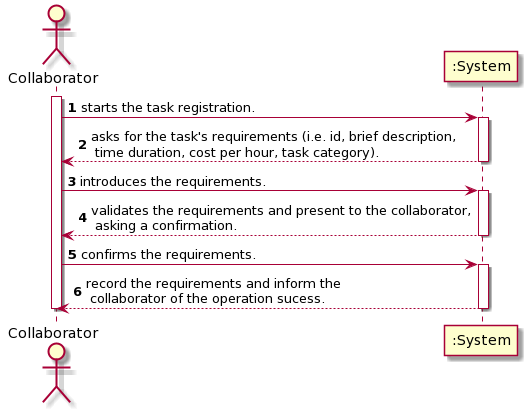
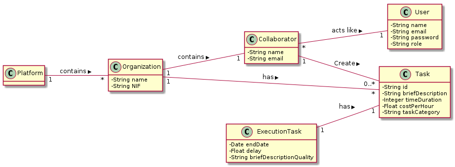
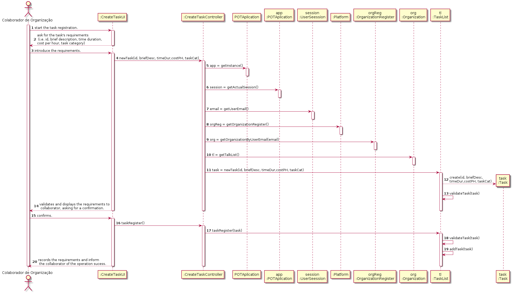
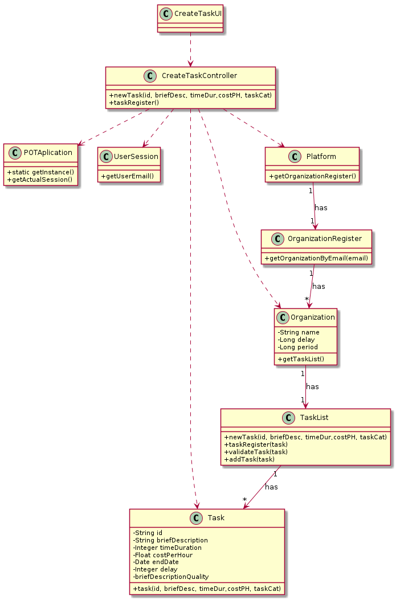

# UC3 - Create Task

## 1. Requirements Engineering

### Briaf format

The collaborator starts the task registration. The system asks for the task's requirements (i.e. id, brief description, time duration, cost per hour, task category). The collaborator introduces the requirements. The system validates the requirements and present to the collaborator, asking a confirmation. The collaborator confirms the requirements. The system record the requirements and inform the collaborator of the operation sucess.

### SSD

### Full Format

#### Main actor

* Collaborator

#### Stakeholders and their interests
* **Collaborator:** intends to specify a task.
* **Organization:** intends that collaborators can specify a task for posterior publication.
* **Freelancer:** intends to apply for a task.
* **T4J:** intends the association of tasks to _freelancers_.

#### Preconditions
\-

#### Postconditions
* The information of the new task is registed in the system.

### Main success scenario (or basic flow)

1. The collaborator start the task registration.
2. The system ask for the task's requirements (i.e. id, brief description, time duration, cost per hour, task category)
3. The collaborator introduce the requirements.
4. The system validates and displays the requirements to collaborator, asking for a confirmation.
5. The collaborator confirms.
6. The system records the requirements and inform the collaborator of the operation sucess.

#### Extensions (or alternative flows)

*a. The collaborator requests to cancel the specification of the task.

> The use case ends.

6a. Missing requirements.
>	1. The system informs the happened.
>	2. O sistema permite a introdução dos dados em falta (step 3)
>
	>	2a. The collaborator don't change the requirements. The use case ends.

6b. The system alert for repeated requirements that should be unique.
>	1. The system alert the collaborator.
>	2. The system allows the collaborator to change requirements (step 3).
>
	>	2a. The collaborator doesn't change the requirements. The use case ends.

6c. The system find invalid requirements.
> 1. The system alert the collaborator.
> 2. The system allows the collaborator to change requirements (step 3).
>
	> 2a. The collaborator doesn't change the requirements. The use case ends.

#### Special requirements

- The time duration is showed in hours.
- The cost per hour is showed in euros.

#### List of Technologies and Data Variations
\-

#### Frequency of Occurrence
\-

#### Open questions

* There are others necessary requirements?
* All requirements must be filled?
* How often does this use case occur?

**

## 2. OO Analysis

## 3. Design - Use case realization

### Racional

| Main flow | Question: What class... | Answer | Justification  |
|:--------------  |:---------------------- |:----------|:---------------------------- |
| 1. The collaborator start the task registration.  |	... interact with the user? | CreateTaskUI |  Pure Fabrication: it is not justified assign this responsibility to any existing class in the Domain Model. |
|  		 |	... coordinates the UC?	| CreateTaskController | Controller |
|  		 |	... create the instance Task? | TaskList | Creator (Regra1) + HC/LC: on MD the organization have Task. By HC/LC delegates this responsability to TaskList.  |
|| ...knows the user/collaborator? | UserSesssion |IE: cf. user management component documentation.|
||...knows the user/collaborator's organization? | OrganizationRegister |IE: know all the organizatons. |
||| Organization | IE: knows yours collaborators. |
||| Collaborator | IE: knows your data (e.g. email). |
| 2. The system ask for the task's requirements (i.e. id, brief description, time duration, cost per hour, task category)| | | |
| 3. The collaborator introduce the requirements.|	... save the data introducted?  | Task | Information Expert (IE)-instance created in the first step: have your own data. |
| 4. The system validates and displays the requirements to collaborator, asking for a confirmation. | ... validate the Task data (local validation)? | Task | IE: local validation.|
||... validate the Task data (global validation)? | TaskList  | IE: The TaskList contains the Task. |
| 5. The collaborator confirms. |	| | |
| 6. The system records the requirements and inform the collaborator of the operation sucess. |		... save the Task created? | TaskList  | IE: The TaskList contains the Task. |  	

### Systematization ##

It follows from the rational that the conceptual classes promoted to software classes are:

 * Organization
 * Collaborator
 * Task

Other software classes (i.e. Pure Fabrication) identified:  

 * CreateTaskUI  
 * CreateTaskController
 * TaskList
 * OrganizationRegister

Other classes of external systems/components:

 * UserSesssion

###	Sequence Diagram

###	Class Diagram

