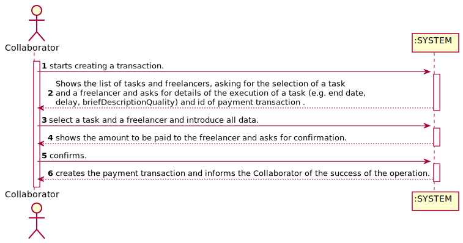
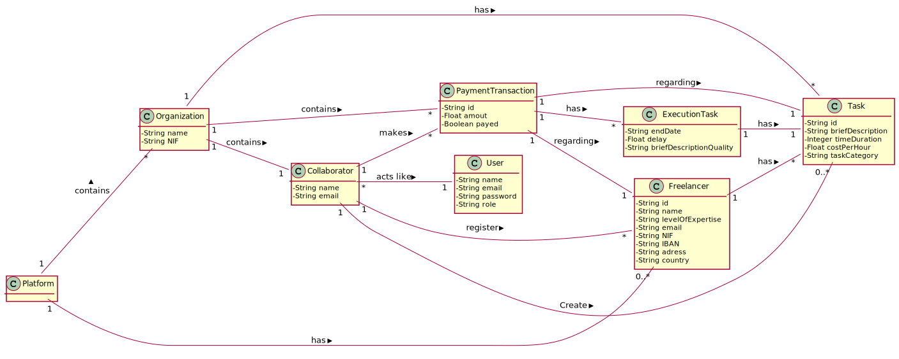
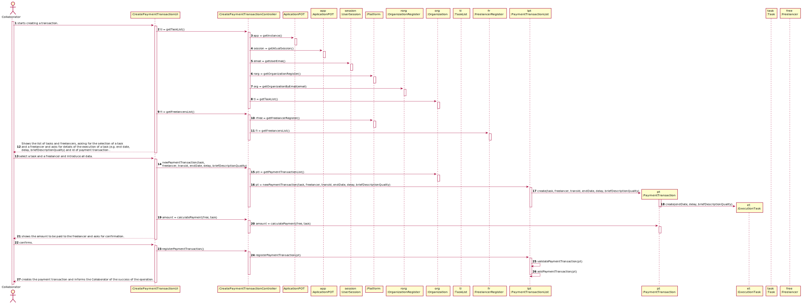
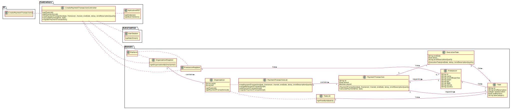

# UC 4 - Create Payment Transition

## 1. Requirements Engineering

### Brief Format

The collaborator starts creating a transaction. The system shows the list of tasks and freelancers, asking for the selection of a task and a freelancer and asks for details of the execution of a task (e.g. end date, delay, briefDescriptionQuality) and id of payment transaction. The Collaborator select a task and a freelancer and introduce all data. The system shows the amount to be paid to the freelancer and asks for confirmation. The collaborador confirms. The system creates the payment transaction and informs the Collaborator of the success of the operation.

### SSD

### Complete Format

#### Main Actor

* Collaborator

#### Stakeholders and their interests

* **Collaborator:** want to manage the payments.
* **Freelancer:** wants to get the remoneration accepted in the contract for the job that he had done.
* **T4J:** wants freelancers to be paid for the work they did.
* **Organization** wants to generate profit.

#### Pre-conditions

* Freelancer must be already registered.
* The Task in question should is already registered

#### Post-conditions
* The payment Transition is created

#### Main success scenario (or basic flow)

1. The collaborator starts creating a transaction.
2. The system shows the list of tasks and freelancers, asking for the selection of a task and a freelancer and asks for details of the execution of a task (e.g. end date, delay, briefDescriptionQuality) and id of payment transaction.
3. The Collaborator select a task and a freelancer and introduce all data.
4. The system validate the information and shows the amount to be paid to the freelancer and asks for confirmation.
5. The collaborador confirms.
6.The system creates the payment transaction and informs the Collaborator of the success of the operation.

#### Extensions (or alternative flows)

*a The Collaborator cancels the operations.
>The use case ends.

4a. Missing mandatory data.
>1. The system informs about the missing data.
>2. The system alows for the introduction of missing data (step 3).
>
>> 2a. The Collaborator doesn't change the data. The use case ends.

4b. The system detects that the data (or some subset of the data) entered * (e.g. email) * must be unique and that it already exists in the system.

>1. The system alerts the Collaboratot to the fact.
>2. The system allows you to change it (step 3)
>> 2a. The Collaborator doesn't change the data. The use case ends.

#### Special Requirements

\-

#### List of changes in technology data

\-

#### Frequency of Occurrence

\-

#### Open Questions

* Are there any other mandatory data in addition to those already known?
* How often does this use case occur?
* Is all data required?

## 2. OO Analysis

## 3. Design - Use Case Realization

### Rational

| Main Flow | Question: What Class ... | Answer  | Justification  |
|:--------- |:------------------------ |:--------|:-------------- |
| 1. The collaborator starts creating a transaction. | ...interacts with the user ? | createPaymentTransactionUI | Pure Fabrication |
|  | ...coordinates the UC?	| CreatePaymentTransactionController |	Controller |
|  | ...creates PaymentTransaction instance? |	Platform	| Creator (Rule 1): on MD the Platform has organizations |
|  |  | OrganizationRegister | IE: in MD the Platform has organizations. By application of HC + LC delegates this function to OrganizationRegister |
|  |  |	Organization	| IE: (Rule 1): on MD the Organization has Payment Transactions |
|  |  | PaymentTransactionList | IE: in MD the organization has payment Transactions. By application of HC + LC delegates this function to paymentTransactionList |
|  | ... do you know the user / collaborator using the system? | User Session | IE: cf. documentation of the user management component.|
| 2. The system shows the list of tasks and freelancers, asking for the selection of a task and a freelancer and asks for details of the execution of a task (e.g. end date, delay, briefDescriptionQuality) and id of payment transaction.||||
| 3. The Collaborator select a task and a freelancer and introduce all data.| ... keep the data entered? | 	Organization	| Creator (Rule 1): on MD the Organization has Payment Transactions |
|  |  | PaymentTransactionList | IE: in MD the organization has payment Transactions. By application of HC + LC delegates this function to paymentTransactionList |
|  |  | PaymentTransaction | IE: has its own data. |
|  | ... do you know the available Freelancers? | Platform | In MD the Platform knows all Freelancers.|
|  |  | RegistoFreelancer | In MD the Platform Knows the freelancers. By application of HC + LC delegates to RegistoFreelancer |
|  | ... do you know the available Tasks? | Organization | In MD the Organization knows all Tasks. |
|  |  | TaskList | In MD the Organization knows the Tasks. | By application of HC + LC delegates to TaskList |
| 4. The system validate the information and shows the amount to be paid to the freelancer and asks for confirmation. | ... validates paymentTransaction data (local validation)? |	PaymentTransaction | IE: has its own data.|
|  | ... validates PaymenTransaction data (global validation)? | PaymentTransactioList | IE: in MD the organization has paymentTransactions. By application of HC + LC delegates this function to PaymentTransactionList |
| 5. The collaborador confirms.||||
| 6.The system creates the payment transaction and informs the Collaborator of the success of the operation.| ... save the paymentTransaction? |	Organization | IE: in MD the organiation has freelancers. |
| |  | PaymentTransactionList	| IE: in MD the organization has paymentTransactions. By application of HC + LC delegates this function to PaymentTransactionList|
| | ... inform the Collaborator? |	createPaymentTransactionUI	| |

### Systematization ##

 It follows from the rational that the conceptual classes promoted to software classes are:

 * Platform
 * OrganizationRegister
 * Organization
 * PaymentTransactionList
 * PaymentTransaction
 * RegistoFreelancer
 * TaskList

Other software classes (i.e. Pure Fabrication) identified:

 * createPaymentTransactionUI
 * CreatePaymentTransactionController
 * User Session

###	Sequence Diagram

###	Class Diagram

