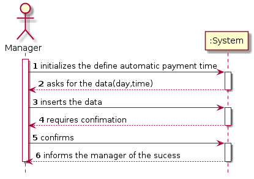
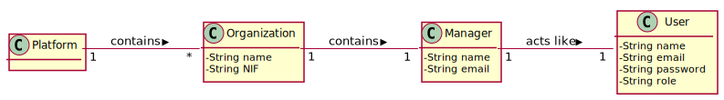
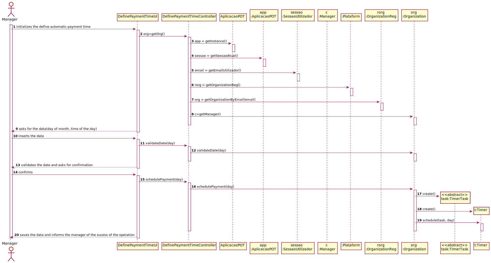
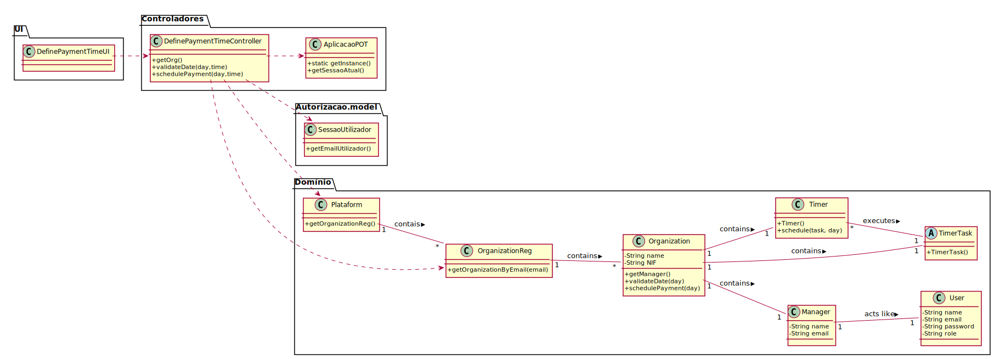

# UC5 - Define automatic payment time

## 1. Engineering Requirements

### Brief format

The manager of the organization initializes the define automatic payment time. The system asks for the date(day of month, time of the day). The manager inserts it. The system saves the data and informs the manager of the sucess of the operation.

### SSD

### Full format

#### Main Actor

Manager of the Organization

#### Stakeholders and their interests

* **Organization:** wants the payments to be made.
* **Manager:** wants the organization to make the payments.
* **Freelancer:** wants to be paid for his work.

#### Preconditions
\-

#### Postconditions
The date of the payments has been changed.

#### Main success scenario (or basic flow)

1. The manager of the organization initializes the define automatic payment time.
2. The system asks for the date(day of month, time of the day).
3. The manager inserts it.
4. The system saves the date and informs the manager of the sucess of the operation.
5. The manager confirms.
6. The system saves the date and informs the manager of the sucess of the operation.

#### Extensions (or alternative flows)

*a. The manager requests the cancellation of the use case.
> The use case ends.

4a. Missing minimum required data.
> 1. The system informs you which data is missing.
> 2. The system allows the re-entry of the data (step 3)
    >
  > 2a. The organization employee does not change the data. The use case ends.

4b. The system detects that the data entered (or some subset of the data) is invalid.
  > 1. The system alerts the organization manager to the fact.
  > 2. The system allows you to change it (step 3).
  >
  > 2a. The organization's manager does not change the data. The use case ends.

#### Special requirements
\-

#### List of Technologies and Data Variations
\-

#### Occurrence frequency
\-

#### Open questions
* How often does this use case occur?

## 2. OO Analysis

### Excerpt from the MD Relevant for UC

## 3. Design - Use Case Realization

### Rational

| Main Flow       | Question: What Class ... | Answer | Justification  |
|:--------------  |:-------------------------|:-------|:-------------- |
| The manager of the organization initializes the define automatic payment time.		 |... interacts with user? | DefinePaymentTimeUI    |  Pure Fabrication |
|  		 |	... coordinates the UC?	| DefinePaymentTimeController | Controller    |
| |...knows the user using the system?|SessaoUtilizador|Information Expert (IE): cf. documentation of the user management component.|
| |...knows which organization the user belongs to?|OrganizationReg|IE: knows all Organizations. HC + LC pattern on Platform: this delegates responsibility to the OrganizationReg|
|||Organization|IE: Organization has a Manager.|
||...knows OrganizationReg?|Plataform| IE: Plataform has OrganizationReg|
| The system asks for the data(day of month, time of the day)|							 |        |
|The manager inserts the date.| | |                                       
|The system validates the data and asks for confirmation.| ... validates the data?(Local Validation) | Organization | IE: owns his own data.|
|The manager confirms.|... stores the data? | Organization | IE: Organization contains the delay and period.|  
| | ... validates the Organization?(Global Validation) | OrganizationReg | IE: OrganizationReg contains Organization. |
| The system saves the data and informs the manager of the sucess of the operation.| ...stores the Organization?| Organization|IE|
| |...informs the Manager?|DefinePaymentTimeUI |
### Systematization ##

 From the rational, the conceptual classes promoted to software classes are:

 * SessaoUtilizador
 * Platform
 * Organization

 Other software classes (i.e. Pure Fabrication) identified:  

 * DefinePaymentTimeUI  
 * DefinePaymentTimeController
 * OrganizationReg

 Other classes from external systems:

  * SessaoUtilizador

###	Sequence Diagram

###	Class Diagram

