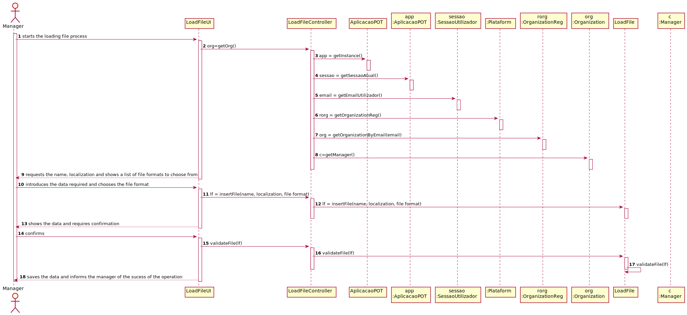

# UC 4 - Load File

## 1. Requirements Engineering

### Brief Format

The manager starts the loading file process. The systems requests the name, localization and shows a list of file formats to choose from. The manager introduces the data required and chooses the file format. The system shows the data and requires confirmation. The manager confirms. Success operation.

### SSD

### Complete Format

#### Main Actor

* Manager

#### Stakeholders and their interests

* **Manager** wants to load a file (txt or csv) that registers a set of (historical) transactions.
* **Organization** wants to get his transactions historic available.

#### Pre-conditions

#### Pos-conditions
* The transactions file is loaded.

#### Main success scenario (or basic flow)

1. The manager starts the loading file process.
2. The systems requests the name, localization and shows a list of file formats to choose from.
3. The manager introduces the data required and chooses the file format.
4. The system shows the data and requires confirmation.
5. The manager confirms.
6. Success operation.

#### Extensions (or alternative flows)

4a. Minimum data required missing-
>1. The system informs about the missing data.
>2. The system alows for the introduction of missing data (step 2).
>
>> 2a. The Manager doesn't change the data. The use case ends.

#### Special Requirements

\-

#### List of changes in technology data

\-

#### Frequency of Occurrence
\- Whenever the manager wants to load a file of payment transactions.

#### Open Questions

## 2. OO Analysis

## 3. Design - Use Case Realization

### Rational

| Main Flow | Question: What Class ... | Answer  | Justification  |
|:--------- |:------------------------ |:--------|:-------------- |
| 1. The manager starts the loading file process. | ... interacts with the user? | LoadFileUI | Pure Fabrication, you cant give this responsability to any other class in the MD. |
|  		 | ... coordenates the UC? | LoadFileController | Controller |
| 2. The systems requests the name, localization and shows a list of file formats to choose from.  | ... who knows the list of file formats? | LoadFile | LoadFile has his own data |
| 3. The manager introduces the data required and chooses the file format. | ...who saves the data? | Organization | Organization has access to all payment transactions |
| 4. The system shows the data and requires confirmation. |   |  |  |
| 5. The manager confirms. ||   |                          |
| 6. Success operation.		 |...who informs the manager?|   LoadFileUI             |||  

### Systematization ##

 It follows from the rational that the conceptual classes promoted to software classes are:

 * LoadFile
 * Organization

Other software classes (i.e. Pure Fabrication) identified:

 * LoadFileUI
 * LoadFileController

###	Sequence Diagram

###	Class Diagram

