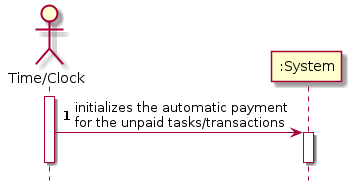
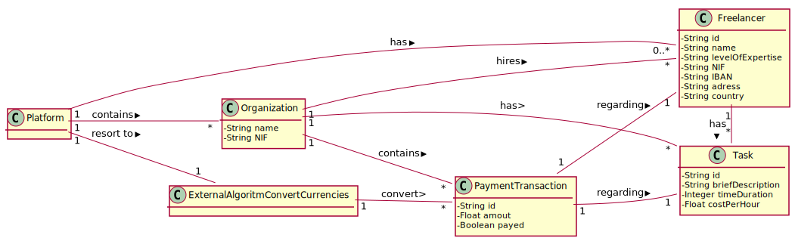
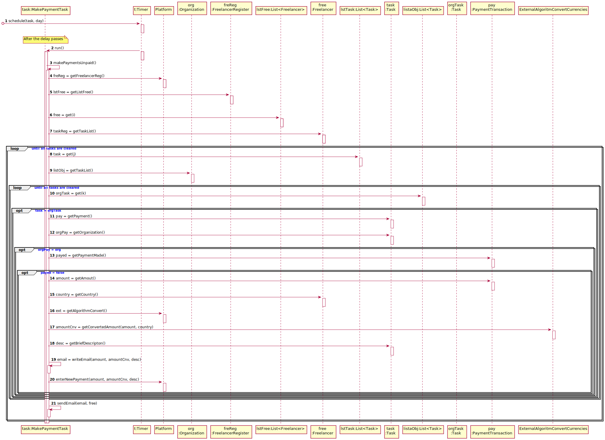
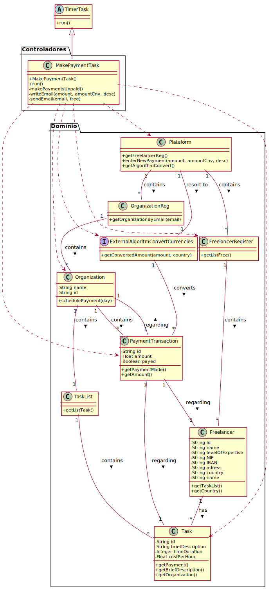

# UC7 - Make Automatic Payment

## 1. Engineering Requirements

### Brief format

The time/clock initializes the automatic payment for the unpaid tasks/transactions.

### SSD

### Full format

#### Main Actor

Time/Clock

#### Stakeholders and their interests

* **Organization:** wants the payments to be made.
* **Manager:** wants the organization to make the payments.
* **Freelancer:** wants to be paid for his work.

#### Preconditions

The time for the automatic payment has to be set.

#### Postconditions
The payments have been made.

#### Main success scenario (or basic flow)

1. The time/clock initializes the automatic payment.
2. The system gathers all transactions that haven´t been made yet.
3. The system makes the payment and sends  the receipt to the freelancer by e-mail.
4. The step 3 repeats until all transactions in step 2 have been made.

#### Extensions (or alternative flows)

2a. The system detects that there are none transactions to be made.
> The use case ends.

#### Special requirements
Convert the currency by Country

#### List of Technologies and Data Variations
\-

#### Occurrence frequency
\-

#### Open questions

\-

## 2. OO Analysis

### Excerpt from the MD Relevant for UC

## 3. Design - Use Case Realization

### Rational

| Main Flow       | Question: What Class ... | Answer | Justification  |
|:--------------  |:-------------------------|:-------|:-------------- |
|The time/clock initializes the automatic payment.	 | ... coordinates the UC? | MakePaymentTask |  Pure Fabrication, as it is not justified to assign this responsibility to any existing class in the Domain Model. |
| The system gathers all transactions that haven´t been made yet. |	... knows the Freelancers? | Platform  | IE: Platform has Freelancers|
|	 |							 |    Freelancer |  IE: knows his own data.|
|  | ... knows the Task?	 | Freelancer | IE: On MD Freelancer has Tasks. |
|   		 |							 | Task    |      IE: knows his own data.                        |
|  		 |	... knows the PaymentTransaction?	 | PaymentTransaction | IE           |  
|| ... converts the amount to other currencies?|ExternalAlgorithmConvertCurrencies|IE: on MD ExternalAlgorithmConvertCurrencies converts the amount.|
||...knows the ExternalAlgorithmConvertCurrencies?| Platform | IE: on MD, Platform resorts to ExternalAlgorithmConvertCurrencies.|
||...implements the particularities of each external algorithm in concrete?|ExternalAlgorithmConvertCurrencies|Protected Variation + Adapter |
| The system makes the payment and sends  the receipt to the freelancer by e-mail.| ... writes the email? | MakePaymentTask | |
|| ... register the payment? | Platform|IE: Platform contains Organization|

### Systematization ##

 From the rational, the conceptual classes promoted to software classes are:

 * Organization
 * Platform
 * Task
 * PaymentTransaction
 * Freelancer

 Other software classes (i.e. Pure Fabrication) identified:  

 * MakePaymentTask
 * TaskList

 Other classes from external systems:

 * ExternalAlgorithmConvertCurrencies

###	Sequence Diagram

###	Class Diagram

