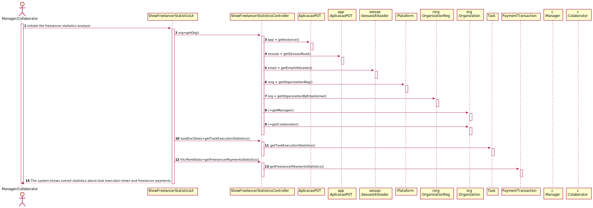

UC8 - Show Freelancer Statistics

## 1. Requirements Engineering

### Brief Format

  The Manager/Collaborator initiate the freelancer statistics analysis. The system shows overall statistics about task execution times  and freelancer payments.

### SSD

### Full Format

The Manager/Collaborator initiate the freelancer statistics analysis. The system shows overall statistics about task execution times (the mean and the standard deviation of the delays, of each one and of all freelancers, and a histogram to analyze the delays of each one and all the freelancers working to the organization) and freelancer payments (the mean and the standard deviation of the payments made to each one of the freelancers).

#### Main actor

Manager/Collaborator

#### Stakeholders and their interests
* **Manager/Collaborator:** wants to see overall statistics about task execution times and freelancer payments.

#### Preconditions
#### Postconditions

#### Main success scenario (or basic flow)

1. The Manager/Collaborator initiate the freelancer statistics analysis.
2. The system shows overall statistics about task execution times (the mean and the standard deviation of the delays, of each one and of all freelancers, and a histogram to analyze the delays of each one and all the freelancers working to the organization) and freelancer payments (the mean and the standard deviation of the payments made to each one of the freelancers)

#### Extensions (or alternative flows)

#### Special requirements
\-

#### List of Technologies and Data Variations
\-

#### Frequency of Occurrence
\- Whenever the Manager/Collaborator want to see/analyze overall statistics about task execution times and freelancer payments.

#### Open questions

## 2. OO Analysis

### Excerpt from the Relevant Domain Model for the UC

## 3. Design - Use Case Realization

### Racional

| Main Flow | Question: What Class... | Answer  | Justification  |
|:--------------  |:---------------------- |:----------|:---------------------------- |
| 1. The Manager/Collaborator initiate the freelancer statistics analysis. | ... interacts with the user? | ShowFreelancerStatisticsUI | Pure Fabrication, you cant give this responsability to any other class in the MD. |
|  		 | ... coordenates the UC? | ShowFreelancerStatisticsController | Controller |
| 2. The system shows overall statistics about task execution times (the mean and the standard deviation of the delays, of each one and of all freelancers, and a histogram to analyze the delays of each one and all the freelancers working to the organization) and freelancer payments (the mean and the standard deviation of the payments made to each one of the freelancers)  | ... who knows the task execution statistics? | Task  | Class Task has his own attributes  |
|| ... who knows the freelancer payments statistics? | PaymentTransaction | Class PaymentTransaction has his own attributes |

### Systematization ##

It follows from the rational that the conceptual classes promoted to software classes are:

* Task
* PaymentTransaction

Other software classes (i.e. Pure Fabrication) identified:

* ShowFreelancerStatisticsUI
* ShowFreelancerStatisticsController

###	Sequence Diagram

###	Class Diagram

