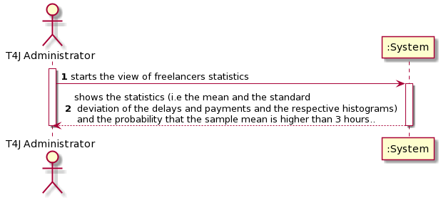
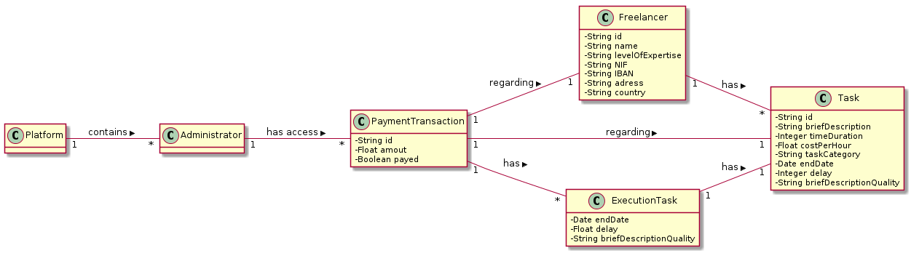
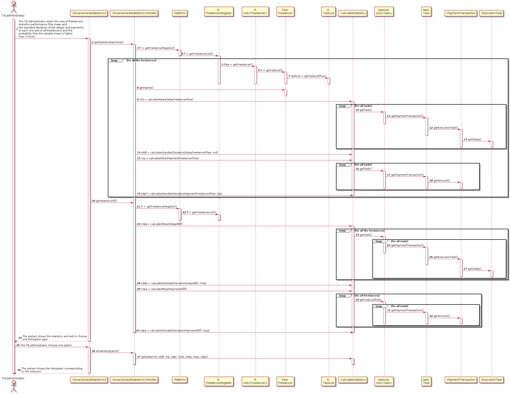
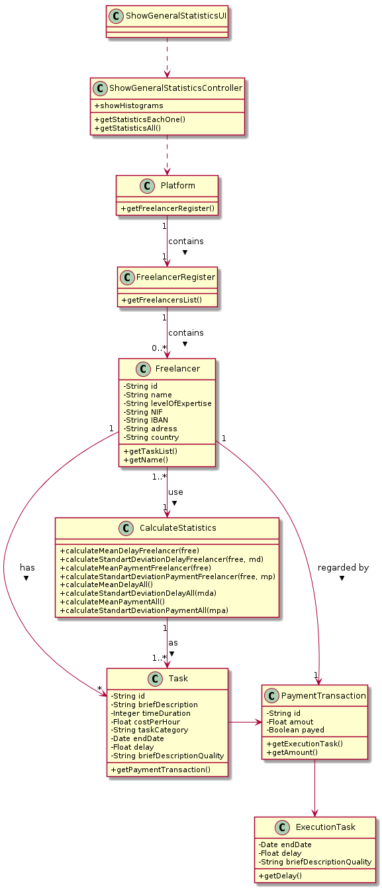

# UC9 - Show the _freelancers_ performance statistics

## 1. Requirements Engineering

### Briaf format

The T4J administrator starts the view of freelancers performance statistics. The system shows the statistics (i.e the mean and the standard deviation of the delays and payments and the respective histograms) and the probability that the sample mean is higher than 3 hours.

### SSD

### Full Format

#### Main actor

* T4J Collaborator

#### Stakeholders and their interests

* **T4J:** intends to see the freelancers performance.

#### Preconditions

* _Freelancers_ need to be registed in the system.

#### Postconditions

* The T4J administrator could see the freelancers performance.

### Main success scenario (or basic flow)

1. The T4J administrator starts the view of freelancers statistics performance (the mean and the standard deviation of the delays and payments, of each one and of all freelancers) and the probability that the sample mean is higher than 3 hours.
2. The system shows the statistics and ask to choose one histogram type.
3. The T4J administrator choose one option.
4. The system shows the histogram corresponding to the selection.

#### Extensions (or alternative flows)

*a. The collaborator requests to cancel the view of freelancers performance statistics*

> The use case ends.

4a. There's no _freelancers_ registed in the sytem.

>	1. The use case ends.

#### Special requirements
\-

#### List of Technologies and Data Variations
\-

#### Frequency of Occurrence

* Whenever the T4J administrator want to see/analyze statistics about performance of _freelancers_.

#### Open questions

* Should the statistics of each one and all _freelancers_ be showed togheter?
* How often does this use case occur?

## 2. OO Analysis

## 3. Design - Use case realization

### Racional

| Main flow | Question: What class... | Answer | Justification  |
|:--------------  |:---------------------- |:----------|:---------------------------- |
| 1. The T4J administrator starts the view of freelancers statistics performance (the mean and the standard deviation of the delays and payments, of each one and of all freelancers) and the probability that the sample mean is higher than 3 hours.|	...interact with the user? | ShowGeneralStatisticsUI |  Pure Fabrication: it is not justified assign this responsibility to any existing class in the Domain Model. |
|	 |	...coordinates the UC?	| ShowGeneralStatisticsController | Controller |
||...has the freelancers?| Platform | IE: have the FreelancersList |
|||FreelancersList| By HC/LC delegates this responsability to Freelancersist.|
|||Freelancer| Has your own data |
||...has the Freelancer delays? | Task | IE: has associated a payment transaction |
||| PaymentTransaction | IE: has associated an execution task |
||| ExecutionTask | IE: has the dalays data |
|| ...has the freelancers payments?  |Task | IE: has associated a payment transaction |
||| PaymentTransaction | IE: has the payments data |
||...calculate the mean and the standart deviation?| CalculateStatistics | HC/LC: has associated the Freelancers and calculate your statistics |
||...calculate the probability? | CalculateStatistics | HC/LC: has associated the Freelancers and calculate your probability |
| 2. The system shows the statistics and ask to choose one histogram type.| | | |
| 3. The T4J administrator choose one option.| ...has the data for histograms? | CalculateStatistics | HC/LC: has associated the Freelancers and calculate your statistics |
| 4. The system shows the histogram corresponding to the selection.|||| 	

### Systematization ##

It follows from the rational that the conceptual classes promoted to software classes are:

 * Platform
 * Freelancer
 * Task
 * PaymentTransaction
 * ExecutionTask

Other software classes (i.e. Pure Fabrication) identified:  

 * ShowGeneralStatisticsUI
 * ShowGeneralStatisticsController
 * FreelancerList
 * TaskList
 * CalculateStatistics

###	Sequence Diagram

###	Class Diagram

